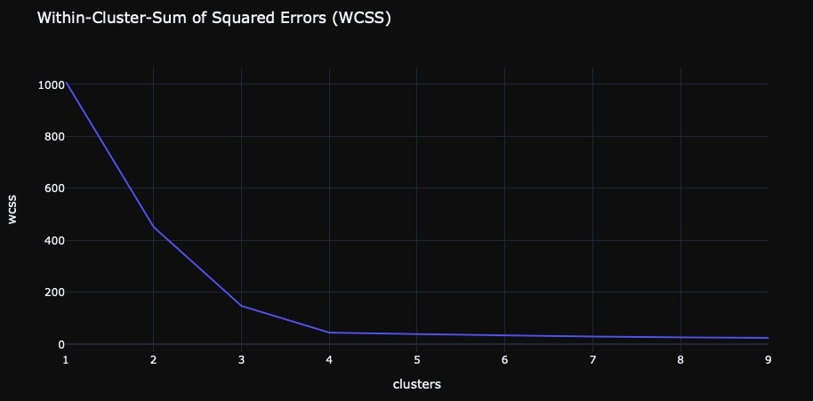
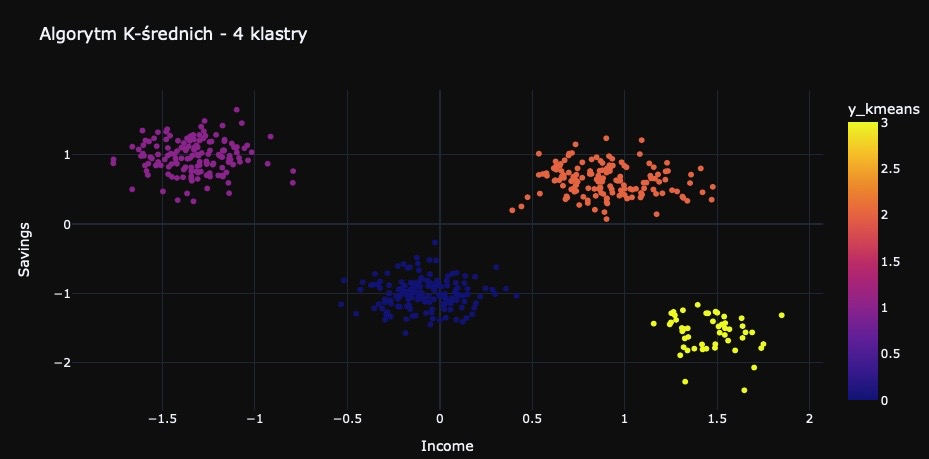
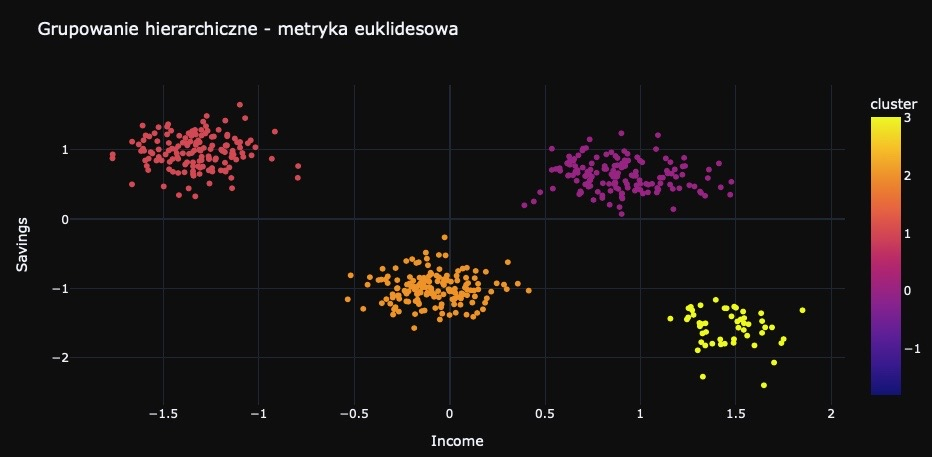

# Klasteryzacja

## Dane
Plik z danymi zawiera informacje o czterech cechach klientow sklepow jubilerskich. Nie wystepuje podzial na zmienne objasniane i objasniajaca.
Dane zostaly pobrane z serwisu kaggle.com

## Informacje
Celem projektu jest przetestowanie algorytmow: K-srednich, grupowania hierarchicznego oraz DBScan, celem znalezienia wzorow
w zachowaniach klientow, co moze pomoc w efektywniejszym dopasowaniu oferty dla poszczegolnych klientow.
Kod napisany w 2022 r. w języku Python 3.

## Pliki
- jewellery.csv - plik z danymi
- klasteryzacja.py - kod

## Przykladowe rezultaty dzialania programu

